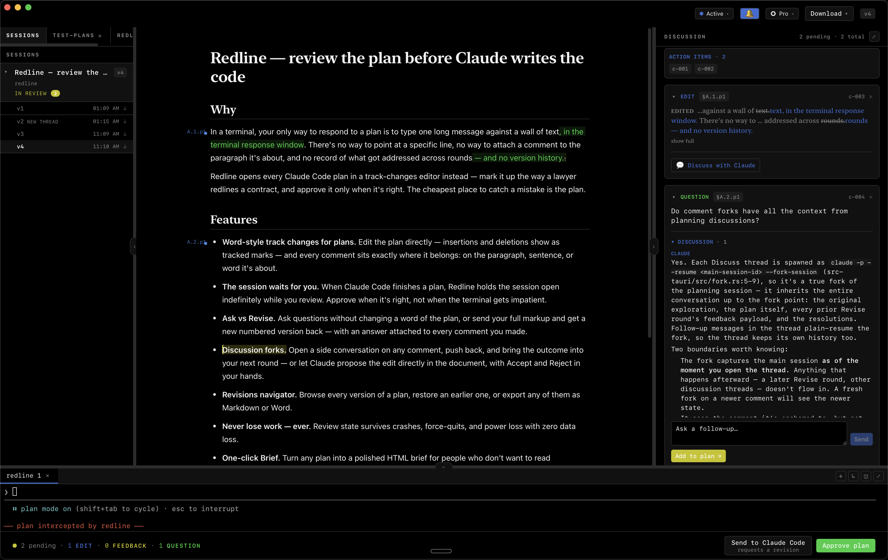

# Redline

**The planning IDE for Claude Code.** — [redline.dev](https://redline.dev)

Redline is a desktop app where Claude Code plans live. When Claude Code finishes planning, the plan opens in Redline instead of a terminal prompt — mark it up with Word-style tracked changes and margin comments, ask questions, iterate through revisions, and approve it only when it's right. Your markup flows back into the live session as structured feedback Claude Code can act on precisely.



## Why

In the terminal, your only way to respond to a plan is to type one undifferentiated prose message against a wall of text. There's no way to point at a specific line, no way to attach a comment to the paragraph it's about, and no record of what got addressed across iterations.

Redline was built by a lawyer who wanted to mark up plans the way lawyers redline contracts: tracked changes, margin comments, and nothing accepted until it's resolved.

The underlying bet is that the cheapest place to catch a mistake is the plan. Redline is built for spending real time on a spec — rounds of redlines, questions, and revisions — before any code gets written.

## How it works

1. **Intercept.** Redline installs a `PreToolUse` hook on `ExitPlanMode` in `~/.claude/settings.json`. When Claude Code exits plan mode, the plan is POSTed to a local daemon (`127.0.0.1:7676`) and the request is held open — for up to 12 hours — while you review.
2. **Redline.** The plan opens in a track-changes editor. Edit text inline (insertions and deletions appear as tracked marks), and attach **edits**, **feedback**, **questions**, and **structural changes** (insert, delete, or move whole blocks) exactly where they apply.
3. **Submit.** Two modes: **Ask** sends questions only and guarantees the plan body comes back unchanged; **Revise** sends your full markup and drives a new revision.
4. **Resolve.** Claude Code revises the plan following the `redline` skill contract. The new revision arrives with a resolution attached to each of your comments — accept it, or reopen it with a follow-up note for the next round.

The hook and skill are installed by the app itself: on first run, Redline detects they're missing and offers one-click setup.

## Features

- **Track-changes editor** — Tiptap/ProseMirror with inline suggestion marks, anchored comment threads, and an accept/reopen lifecycle that keeps the history of every round.
- **Integrated terminals and file explorer** — real PTY-backed shells (xterm.js) and a sidebar file tree with a fast read-only viewer (syntax highlighting off the UI thread, virtualized for large files), so you can review the plan next to the code it touches.
- **Ask vs Revise round-trips** — question-only rounds never bump the plan version; if the plan body changes during an Ask round, Redline flags the contract violation.
- **Discussion forks** — open a read-only side conversation with the agent on any comment, then attach the outcome to your next submission.
- **Revisions navigator** — browse every version of a plan (v1, v2, …), restore an earlier one, and export any revision as clean Markdown or DOCX.
- **Three interception modes** — Active (hold the session until you decide), Ambient (a claimable auto-approve countdown), and Paused (approve everything, capture nothing).
- **Built to not lose your work** — review state persists through crashes (Yjs + IndexedDB), sessions live in SQLite, and a tray icon shows pending reviews at a glance.

<!-- SCREENSHOT PLACEHOLDER: 1–2 feature shots — e.g. a discussion fork open beside a comment; the revisions navigator showing v1→v3. -->

## Installation

There are no prebuilt binaries yet; for now, build from source.

<!-- RELEASES PLACEHOLDER: once binaries are published, replace the line above with a link to the Releases page. -->

**Prerequisites**

- macOS 11 or later (Apple Silicon or Intel)
- [Claude Code](https://claude.com/claude-code)
- Node.js ≥ 20 and npm
- Rust (stable, via [rustup](https://rustup.rs))
- Xcode Command Line Tools (`xcode-select --install`)

**Build and install**

```bash
git clone https://github.com/sersiousSenpai/redline.git
cd redline
npm install
npm run redline
```

`npm run redline` builds the app, installs it into **/Applications**, and launches it. From then on, open Redline like any Mac app — Spotlight, Dock, Launchpad. The first build takes several minutes (it compiles the app's native dependencies from source); after that, builds are fast.

**Updating** (until prebuilt downloads ship):

```bash
git pull && npm run redline
```

**First-run setup**

On launch, Redline checks for its Claude Code integration and offers a one-click install that writes two things:

- a `PreToolUse` hook entry in `~/.claude/settings.json` pointing at the local daemon
- the plan-revision skill at `~/.claude/skills/redline/SKILL.md`

Both are inspectable, and the hook can be paused from inside the app at any time.

## Status

Redline is an early release (v0.1) under active development. It currently supports **macOS only** — Windows and Linux are on the roadmap but not yet supported. Bug reports and feedback are welcome — please [open an issue](https://github.com/sersiousSenpai/redline/issues).

## Roadmap

Directions we're exploring, in no particular order:

- Finer-grained comment anchoring (sentence- and word-level)
- Real-time collaboration — multiple reviewers on one plan, each with their own agent
- Reviewing documents beyond Claude Code plans (e.g. DOCX)

## Architecture

Redline is a Tauri 2 app: a React 19 + TypeScript frontend and a Rust backend that embeds an axum HTTP daemon (the hook endpoint), a SQLite session store, and portable-pty for the terminals. The full as-built specification — including the hook wire protocol, the feedback payload format, and the session lifecycle — is in [SPEC.md](SPEC.md), and the contract Claude Code follows when revising a plan is in [skills/redline/SKILL.md](skills/redline/SKILL.md).

## Contributing

Contributions are welcome. **All pull requests are gated by a Contributor License
Agreement** — a copyright-assignment CLA that keeps the Project's copyright unified in a
single owner of record. Agreement is handled automatically by a bot on your first pull
request. See [CONTRIBUTING.md](CONTRIBUTING.md) and [CLA.md](CLA.md).

## License

Redline is licensed under the [Apache License 2.0](LICENSE). See also the [NOTICE](NOTICE)
file. The Apache-2.0 grant covers the **source code only**.

## Trademark

The Apache-2.0 license applies to the code and does **not** grant any rights to the
Redline name, brand, logo, or application icon. "Redline", the Redline name, the Redline
logo, and the Redline application icon are trademarks of Yusuf Al-Bazian and are **not**
licensed under the Apache License.

You may use, modify, and redistribute the source code under Apache-2.0, including for
commercial purposes. You may **not**, without prior written permission, use the Redline
name, logo, or icon in a way that suggests endorsement, affiliation, or that your
derivative work is the official Redline. If you distribute a modified version, please use
a different name and icon. For trademark permission requests, contact
**yab@albazianlaw.com**.
