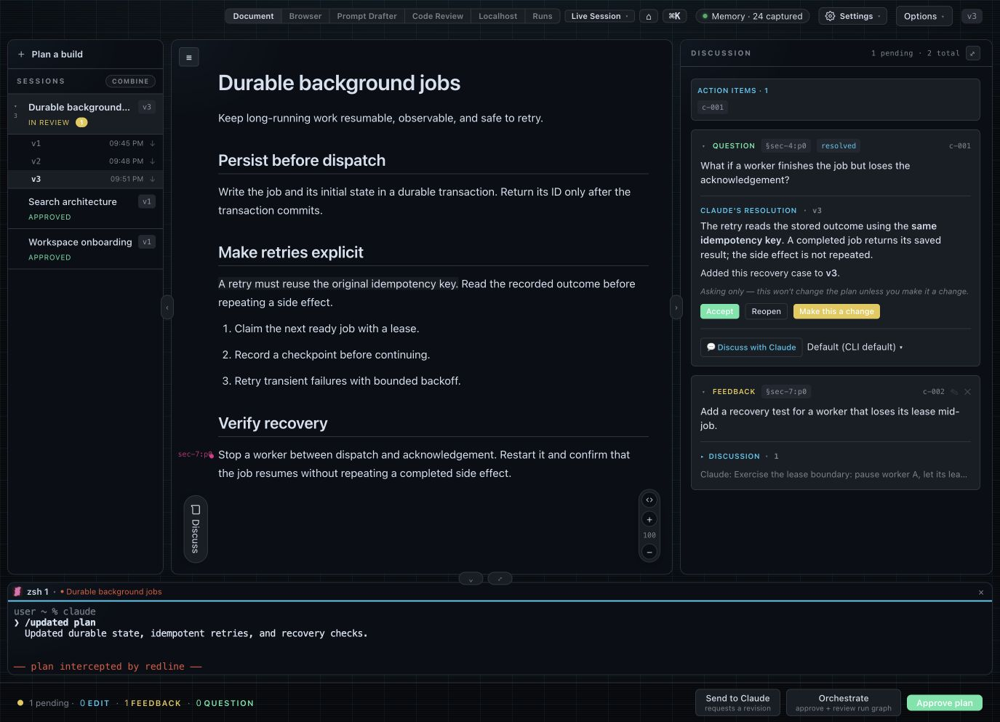

# Redline

**Research it. Draft it. Redline it. Build it.**

A document-centered meta-harness for agent-assisted development on macOS. Bring research, conversations, plans, execution, and code review into one app—with tracked changes and comments that carry your decisions back to the agent.

[Get started](#get-started) · [Explore the surfaces](#the-workspace) · [Technical overview](#under-the-hood) · [Documentation](#documentation)



<sub>This Document preview renders the current app components in the Terminal theme with San Francisco text and sample content. [Browse the preview source and visual references](docs/assets/readme/README.md).</sub>

## The workspace

Start with a question, a document, or a plan. Move between surfaces as the work takes shape.

| Surface | What you can do | A few specifics |
| --- | --- | --- |
| **Home & Chat** | Think through a problem, then turn the conversation into a plan. | Project and provider selection; queued handoffs; links back to the source conversation. |
| **Document** | Edit the plan where it matters. Ask questions, request revisions, and resolve feedback before approval. | Tracked insertions/deletions; anchored comment threads; agent suggestions; version history; Markdown and DOCX export. |
| **Browser & Missions** | Read sources beside an agent, compare pages, and synthesize a research brief. | Native webviews; page and cross-tab discussions; tiled layouts and saved mosaics; source-linked pins and handoffs. |
| **Prompt Drafter** | Shape a brief, specification, or prompt in a real document editor. | Formatting ribbon; tables and Mermaid diagrams; tracked suggestions; Bookshelf folders and templates. |
| **Code Review** | Inspect the implementation and send precise feedback back to the agent. | Unified/split diffs; line annotations; curated AI review findings; working-tree, staged, commit, and base-branch comparisons. |
| **Runs** | Review a task graph, execute it, and inspect the evidence behind each result. | Task/check/review/gate nodes; file ownership; retries; steer, queue, pause, and stop; measured reports. |
| **Memory** | Recover what you asked, what you decided, and why. | Searchable timeline; cited answers; curated class catalog; 3D Memory Cosmos; provenance and health views. |
| **Localhost** | See which development servers belong to which projects. | Port and process discovery; previews; open, stop, and restart controls. |

### Research with the sources in view

Browse several pages together, discuss one page or the whole workspace, and pin the evidence worth keeping. A Mission collects the findings into a sourced document that can continue into the Drafter or a plan.

### Keep the review attached to the work

1. **Start a plan** in Redline, or let an installed provider integration bring one in.
2. **Mark it up** with tracked edits, comments, and questions anchored to the document.
3. **Ask or Revise.** Ask requests answers without changing the plan; Revise sends the markup into the next revision.
4. **Resolve and approve.** Accept resolutions or reopen them with a follow-up. Continue into implementation when the plan is ready.

The **discussion sidecar** keeps questions, feedback, and agent responses beside the plan. **Action items** collect resolutions waiting for Accept or Reopen; a follow-up discussion can become a plan change. The **terminal drawer** stays in view while a plan is intercepted, with a red status strip on the terminal that is waiting for your review.

Voice adds dictation, a plan discussion agent, and read-aloud. PTY terminals and the file explorer keep the repository within reach.

### Run the plan, inspect the result

Orchestrate turns a plan into an editable graph. Review dependencies, models, scope hints, and check commands before starting. Checks retain exit codes and output; independent reviews and human gates control what proceeds.

The native runner currently executes **Claude Code tasks in a shared working tree**, with file claims and check barriers. It leaves changes uncommitted for review. Other planning providers do not yet imply other task-execution backends. [Runner details →](docs/native-runner.md)

For work on Redline itself, **Runs → Build Redline** prepares and verifies a replacement app in a separate candidate workspace, then offers an explicit restart.

## Planning providers

| Provider | Local executable | Plan discussion |
| --- | --- | --- |
| **Claude Code** | `claude` | Claude conversation fork |
| **Codex** | `codex` | Codex conversation fork |
| **Cursor** | `agent` or `cursor-agent` | Separate Claude sidecar |
| **Antigravity Preview** | `agy` | Separate Claude sidecar |

These integrations launch local CLI sessions. Browser, research, voice, and several other agent surfaces still use Claude Code, so keep it installed for the full workspace. Antigravity remains a preview. [Setup and compatibility notes →](docs/getting-started.md#planning-backends)

## Get started

**Early release · macOS 11+ · build from source**

Install Node.js **22.12+** (or 20.19+), stable Rust, Xcode Command Line Tools, CMake, and your planning CLI. Use Claude Code for the full set of agent surfaces.

```bash
git clone https://github.com/sersiousSenpai/redline.git
cd redline
npm ci
npm run redline
```

This builds Redline, installs it into `/Applications`, and launches it. The app guides provider integration setup, executable selection, and readiness checks. [Full installation and development guide →](docs/getting-started.md)

## Under the hood

| Layer | Implementation |
| --- | --- |
| Desktop | Tauri 2, Rust, React 19, TypeScript, Vite 7 |
| Documents | Tiptap / ProseMirror; Yjs document state; IndexedDB review persistence |
| Local state | SQLite sessions, documents, research, and run graphs; hash-chained prompt/decision ledger |
| Agent bridge | axum on `127.0.0.1:7676`; versioned HTTP API; read-only MCP tools at `/mcp` |
| Browser & terminal | Native Tauri child webviews; `portable-pty` and xterm.js |
| Voice | Apple or local Whisper dictation; system/Kokoro local TTS and optional cloud voices |
| Customization | Themes, fonts, workspace manifests, model/effort settings, extension packs, and harnesses |

**Local-first, with your providers.** No Redline account or telemetry. Documents and review state stay on your machine. Agent requests use your installed vendor CLIs and accounts; browsing and optional cloud services use the network.

**Current boundaries:** macOS only; early release; general runner worktree isolation is still future work. Mission monitoring definitions and versioned context can be handed to a compatible runtime; Redline does not provision an external scheduler or machine fleet.

## Documentation

- [Installation, provider hooks, and development](docs/getting-started.md)
- [Native run graphs](docs/native-runner.md)
- [Control-plane API and MCP](docs/api-v1.md)
- [Extension API](docs/extensions-api.md) · [Marketplace and harnesses](docs/marketplace.md)
- [Core specification](SPEC.md) · [Agent skill contracts](skills/)

Found a bug or have an idea? [Open an issue](https://github.com/sersiousSenpai/redline/issues).

## Contributing and license

Redline’s source code is [Apache-2.0 licensed](LICENSE). Contributions require the copyright-assignment [Contributor License Agreement](CLA.md); see [CONTRIBUTING.md](CONTRIBUTING.md) and [NOTICE](NOTICE).

<details>
<summary>Trademark notice</summary>

The Apache-2.0 license applies to the code and does **not** grant any rights to the
Redline name, brand, logo, or application icon. "Redline", the Redline name, the Redline
logo, and the Redline application icon are trademarks of Yusuf Al-Bazian and are **not**
licensed under the Apache License.

You may use, modify, and redistribute the source code under Apache-2.0, including for
commercial purposes. You may **not**, without prior written permission, use the Redline
name, logo, or icon in a way that suggests endorsement, affiliation, or that your
derivative work is the official Redline. If you distribute a modified version, please use
a different name and icon. For trademark permission requests, contact
**yab@albazianlaw.com**.

</details>
