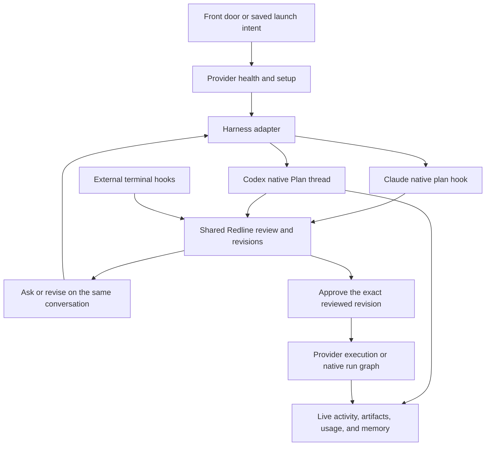

**Harness integration audit — September 28, 2026**

This is the baseline audit written before implementation. The checkout has since changed substantially; see the [Aurora implementation and verification record](aurora-implementation-2026-09-28.md) for what is now implemented and what still needs live acceptance. Line references below describe the audited baseline.

Product direction update: the subsequent [Monochat design](monochat-product-direction-2026-09-28.md) consolidates foreground surface agents into one continuous agent while preserving anchored sidecar discussions and their action-item contract. Recommendations below about provider support remain relevant; they should be implemented through that shared service rather than adding more independent surface agents.

Redline has useful integration infrastructure, but its setup UI, readiness display, and launch gate disagree about what makes a provider ready. Codex exposes that disagreement particularly clearly: automatic setup is restricted to Claude Code, some Codex requirements appear only at launch, and the inline recovery component can immediately dismiss those requirements as resolved. A setup modal should be the visible part of one shared integration lifecycle.

At the audit stage, only the Memory checkbox and related copy had changed. The running packaged application's build, environment, selected binary override, and native UI were not inspected; findings about the checkout must not be mistaken for a reproduction in that particular running application. The later implementation changes source code; it does not silently install or trust hooks in the user's active harness profiles.

**Observed locally**

The environment visible to this session resolves the default Codex home to `/Users/yusufalbazian/.codex`. Both the ChatGPT-bundled CLI (`0.155.0-alpha.9.2`) and Homebrew CLI (`0.157.1`) exist. Redline's hook entries, planning profile, and launcher exist. The profile's developer instructions and the launcher match this checkout. The installed `redline-plan-review` and `companion` skills differ from their checkout sources. These observations support a stale-integration explanation; they do not establish which blocker the running app returned.

Both binaries expose the help entries currently checked by Redline. Their generated app-server schemas include `hooks/list`, `account/read`, and `model/list`. With `--experimental`, both also include the approval adapter's `thread/settings/update`, `thread/queue/list`, and `thread/queue/add`. This verifies schema presence, not successful runtime handoff or account access. Default schema generation omits those experimental methods, so a compatibility checker must request the experimental schema deliberately.

**Prioritized findings**

| Priority | Finding and consequence | Required change |
| --- | --- | --- |
| P0 | Automatic setup excludes Codex. `setupModalActive` explicitly requires `claude-code`; the mounted modal receives a Claude-only install action. Optional Codex props in `HookSetupModal` do not make that path reachable. [App.tsx](../src/App.tsx:6499), [modal mounting](../src/App.tsx:10038) | Open provider-specific setup after detecting a missing critical component at startup or provider selection. Make launch-time recovery enter the same modal. |
| P0 | Displayed readiness and launch readiness disagree. The shared display input omits `requireIntegration`; the launch boundary adds it. Missing Codex hooks change from warning to blocker, while missing/stale Codex skills appear only at launch. [display input](../src/App.tsx:6731), [launch gate](../src/App.tsx:5748), [requirements](../src/lib/readiness.ts:362) | Derive the visible state and launch permission from the same operation-specific requirements. Keep a final launch recheck for external changes. |
| P0 | The recovery message can disappear immediately. `BlockedLaunch` invokes `staleBlocker`, which looks only at blockers in the displayed readiness list. A warning or absent skill requirement is interpreted as a resolved fault. [BlockedLaunch](../src/components/ReadinessStrip.tsx:99), [staleBlocker](../src/lib/launch.ts:153) | Clear a refusal only when a newer matching health result confirms resolution. Test the complete interaction across the readiness derivation and component. |
| P1 | A whole skill bundle controls planning readiness. `get_codex_status` requires every embedded skill to match, including unrelated seats. A Companion skill update can block planning and be described as a review-skill installation problem. [skill aggregation](../src-tauri/src/skill.rs:202), [launch requirement](../src/lib/readiness.ts:434) | Return per-component states and declare dependencies per operation. Planning should require its actual contracts; unrelated features should report their own maintenance needs. |
| P1 | Installation reports completion too early and handles partial failure poorly. Three Codex invokes run sequentially in one `try`; failure skips remaining steps and bypasses cache invalidation. Success refreshes health but does not assert that launch requirements are satisfied before announcing success. [installer](../src/App.tsx:6460) | Use one native install/repair operation with structured step results, progress, single-flight protection, and mandatory verification. Report files installed separately from integration ready. |
| P1 | Installed hooks are not necessarily active. Status compares command/type/async fields in one file; it does not evaluate effective trust, enablement, parse errors, or timeout correctness. The fallback trust warning appears after 90 seconds and is suppressed after any plan has ever arrived. [hook status](../src-tauri/src/codex_hook.rs:61), [silence heuristic](../src/lib/readiness.ts:305) | Query effective hooks for the selected project using `hooks/list` where supported. Track trust by definition hash. Guide the user through Codex's native review flow and recheck afterward. |
| P1 | Authentication is inferred from `auth.json`. A nonempty token is accepted; absence is rejected. This cannot reliably handle credential stores, provider auth, or expired credentials. [auth probe](../src-tauri/src/preflight.rs:269) | Use the selected CLI's supported account interface. Represent authenticated, sign-in-required, unknown, and probe failure distinctly. |
| P1 | Compatibility is approximated by help text and a lower version bound. `>= 0.154.0` does not prove future builds retain the experimental settings/queue contract. Automatic discovery ranks the newest capable candidate using the shallower help check. [version gate](../src-tauri/src/codex_app_server.rs:198), [capability check](../src-tauri/src/codex_app_server.rs:304), [approval RPCs](../src-tauri/src/codex_app_server.rs:482) | Maintain operation-specific protocol requirements, versioned schema fixtures, and a bounded handshake. A newer build is neither automatically broken nor automatically verified. |
| P1 | Codex home resolution is inconsistent. Hooks and profile honor `CODEX_HOME`; skills always use `$HOME/.codex/skills`. [home resolver](../src-tauri/src/codex_profile.rs:57), [skill resolver](../src-tauri/src/skill.rs:179) | Resolve one effective environment for probing, installation, planning, discussion, approval, and restore. Include its identity in health results. |
| P1 | Several preflight subprocesses have no execution deadline. Version/help/model probes and the login-shell fallback use blocking `.output()`. Moving them to `spawn_blocking` avoids blocking the async executor but does not bound launch latency. Errors at idle become console output; focus errors are swallowed. [Codex probes](../src-tauri/src/codex_app_server.rs:184), [shell fallback](../src-tauri/src/binprobe.rs:140), [UI refresh](../src/App.tsx:6656) | Bound each probe, terminate and reap timed-out children, retain bounded diagnostics, and show a persistent retryable health error. |
| P2 | Cache identity is narrower than the readiness question. Frontend health keys contain only backend and extension intent. Backend caches can retain transient failures until binary identity changes or a manual override resets them. Auth/config changes need different invalidation from binary capability changes. [health cache](../src/lib/integrationHealth.ts:96), [binary cache](../src-tauri/src/binprobe.rs:68) | Separate capability caching from mutable account/config/hook state. Tag snapshots with the selected provider, binary identity, effective home, project, and generation; reject stale UI responses. |
| P2 | Update maintenance is asymmetric. The post-reveal effect repairs stale Claude skills, including when Codex is selected, but does not repair stale Codex skills/profile. [maintenance effect](../src/App.tsx:6665) | Apply maintenance only to the intended integration. Detect component drift and offer one coherent repair path, preserving hook trust requirements. |

The hook JSON writer already preserves foreign handlers, stages edits, backs up existing configuration, checks for concurrent modification, and uses atomic replacement. Preserve that implementation. The profile/launcher and skill writers use direct whole-file writes, so those parts still need interruption-safe staging and recovery. See [hook_config.rs](../src-tauri/src/hook_config.rs:32), [profile writes](../src-tauri/src/codex_profile.rs:135), and [skill writes](../src-tauri/src/skill.rs:256).

**Reproduced readiness failure**

Executing the actual `deriveReadiness`, `attemptLaunch`, and `staleBlocker` functions with otherwise healthy Codex inputs produced:

| Condition | Front-door readiness | Launch result | Inline error treated as resolved |
| --- | --- | --- | --- |
| Missing Codex hook | Warning | Blocked: `codex-hook-missing` | Yes |
| Missing Codex skill | Empty | Blocked: `skill-stale` | Yes |
| Stale Codex skill | Empty | Blocked: `skill-stale` | Yes |

This directly explains a toast becoming the remaining feedback for these cases. A missing profile is already a visible blocker in the checkout, so it should not be grouped with the hidden skill requirement when diagnosing the exact reported message.

**Desired interaction**

1. Render the front door immediately with the selected provider visibly checking. Keep prompt editing available. Do not present unknown health as ready.
2. Once the selected provider has a critical problem, open a focused modal such as “Set up Codex for Redline” or “Update the Redline integration.” Show the actual problem, detected CLI version/path, and a short component list. Offer the relevant primary action and “Use another provider” or “Later.” Dismissal leaves a persistent setup action and disables the affected launch.
3. Distinguish installing Codex itself from installing Redline's files. If the CLI exists, offer “Install integration” or “Repair integration.” If it is absent, provide a supported install route with progress. If incompatible, offer a verified alternative already installed or an update through the installation's owner; do not overwrite an app-bundled executable with a package-manager update. Official CLI documentation supports standalone, npm, and Homebrew installation routes. [Codex CLI documentation](https://learn.chatgpt.com/docs/cli)
4. Preserve the entire intended launch: prompt, attachments, combined-plan references, project, backend, model, effort, and destination. If setup follows a submitted launch, make the primary action “Install and continue.” Continue once, only after requirements are verified. Setup triggered merely by selecting Codex must not launch anything automatically.
5. Keep progress and errors in the modal. Report the failed component and practical next action: retry, sign in, inspect malformed configuration, choose another binary, or review hooks. Installation success must transition to verification before readiness.
6. If trust is required, open or focus the correct Codex terminal and guide the user to its hook review. New or changed hook definitions are skipped until trusted; installation alone does not establish trust. Do not bypass that review. [Official hook trust behavior](https://learn.chatgpt.com/docs/hooks)
7. Once verified, resume the pending launch or close setup with the provider ready. Recheck on external changes and when returning to Redline. Avoid reopening the modal repeatedly for the same dismissed condition; reopen on an explicit attempt to use the blocked provider or a materially new failure.

The modal should support keyboard focus, accessible dialog semantics, and Redline's existing native-webview overlay contract. Browser handoffs, Drafter sends, combinations, and restores should enter the same recovery coordinator rather than implementing their own toast-only paths.

**Shared integration contract**

Retain `integrationHealth` as the coordination layer, but replace the implicit collection of booleans with an explicit result for a provider and operation. Suggested phases are `checking`, `action-required`, `installing`, `verifying`, `ready`, and `error`. Component results should distinguish missing, outdated, invalid configuration, incompatible, untrusted, disabled, unknown, and ready. Include a stable reason code, user-facing explanation, supported actions, diagnostic details, and snapshot identity.

The native backend should own environment resolution, capability checks, install jobs, and verification. React should present that result and preserve user intent. The front door, setup dialog, launch guard, and restore flow should consume the same requirement definitions. A cheap file check can answer early while bounded protocol checks finish; an incomplete result must remain visibly incomplete.

Use `account/read` for account state and a guided supported login flow. Codex supports file, OS keyring, automatic, and ephemeral credential storage, so checking one credential file is insufficient. [Authentication documentation](https://learn.chatgpt.com/docs/auth)

The locally generated schemas provide a concrete hook-health path: `hooks/list` accepts `cwds`; hook metadata includes `enabled`, `currentHash`, `trustStatus`, `timeoutSec`, and source information; response entries contain errors and warnings. Trust states include managed, untrusted, trusted, and modified. Validate this contract against each supported binary before relying on it; these observations come from the two local CLI schemas, not an assumed universal interface.

For compatibility, check the CLI flags and protocol methods required by each operation, including the experimental approval queue and settings methods. Codex supports generating schemas for the exact installed version and requires explicit opt-in for experimental API fields and methods. [App-server documentation](https://learn.chatgpt.com/docs/app-server)

Prefer the documented `model/list` interface for catalog discovery, and keep catalog/account freshness separate from executable capabilities. A catalog entry alone is not proof that an account can run a model.

An integration update should stage and validate files, preserve user-owned configuration, record completed steps, and re-probe even after failure. Retry must be idempotent and safe after partial completion. Do not claim an atomic transaction across multiple files without a journal/recovery mechanism. Hook command changes require trust revalidation; unchanged definitions should not be rewritten unnecessarily.

Keep active sessions on their existing process and record the binary/integration identity used for a launch. A CLI update should trigger verification for future launches without abandoning a held review. Preserve the existing approval behavior that leaves a review pending after a failed handoff. Capture bounded, redacted diagnostics identifying the failed stage; the current launcher deletes its temporary server log on exit, making structured diagnostics especially valuable.

**Delivery order and acceptance evidence**

The broader Claude/Codex parity work below extends this immediate reliability sequence. Fix the existing launch experience first; introduce native protocol control incrementally, with the current adapter retained for externally launched sessions.

| Order | Work | Acceptance evidence |
| --- | --- | --- |
| 1 | Unify displayed and enforced planning requirements; enable provider-specific setup and preserve submitted intent. | Missing/stale Codex components open setup before launch; errors remain visible; successful repair continues exactly once; dismissal and provider switching preserve the prompt. |
| 2 | Add typed component health, consistent Codex home, guided trust/auth, bounded probes, and verified install results. | Tests cover custom home, keyring/no auth file, modified/untrusted hooks, malformed JSON, read-only files, partial writes, timeout, and retry. Unknown is never reported as installed or signed out. |
| 3 | Add protocol compatibility fixtures and an update matrix. | Schema tests cover stable and experimental requirements. Isolated integration tests cover plan, revision, approval, interruption, and restore on supported versions. Newer unsupported behavior produces actionable diagnostics and retains the pending review. |
| 4 | Exercise the packaged UI and all launch entrances. | Native walkthrough covers fresh install, existing stale integration, rapid provider switching, install cancellation/retry, app restart, and upgrade during a held review. Native browser content stays beneath the setup modal. |

Existing useful foundations include consolidated preflight, a final launch gate, binary identity caches, preservation of failed-launch composer content, atomic hook configuration edits, and an isolated Codex approval fixture. Extend these rather than building another independent installer beside them.

Verification performed for this audit: **263 tests passed across 12 targeted Vitest files**: `readiness`, `integrationHealth`, `launch`, `launchInvariants`, `FrontDoor`, `planLaunchCommand`, `resumeCommand`, `restoreHarness`, `restoreWiring`, `restoreAttempt`, `backendChoice`, and `planningProviders`. `npx tsc --noEmit` passed after the Memory copy change. The separate cross-function reproduction above exposed the readiness mismatch despite that passing baseline. Local CLI version/help/schema checks made no model requests and used disposable directories for generated schemas. The existing real-TUI approval fixture was inspected but not rerun; the last documented handoff verification is Codex `0.154.0` in [protocol-verification.md](protocol-verification.md:722). No full packaged-app, live authentication, hook-trust, or approval cycle is claimed by this audit.

**Claude's complete flow is the experience benchmark**

Claude benefits from a longer chain of coordinated behavior, and that chain extends well beyond selecting a model. Codex already reuses Redline's core review semantics; the gaps are concentrated around entering, observing, continuing, and recovering the session, plus participating in the rest of the product.

| Stage | Claude Code in this checkout | Codex in this checkout | Parity requirement |
| --- | --- | --- | --- |
| Setup | Automatic hook/skill modal; stale-skill maintenance. | No automatic setup modal; fragmented component status. | Selected-provider setup, accurate readiness, and repair before launch. |
| Start | CLI starts in native plan mode with model/effort, project, and approved research tools. | Wrapper starts an app-server and remote TUI in read-only/default mode with generated planning instructions. | Redline-managed sessions should enter native Codex Plan collaboration mode through the app-server. Keep read-only enforcement independent of prompt obedience. |
| Plan arrival | `PreToolUse(ExitPlanMode)` provides a dedicated plan payload. | Stop handler searches `last_assistant_message` for exactly one complete `<proposed_plan>` envelope. | Consume completed native plan items for managed sessions, with stream previews kept separate from accepted revisions. Retain strict envelope capture for external terminal sessions. |
| Review semantics | Shared parsing, block IDs, comments, resolutions, Ask versus Revise, versioning, Ambient behavior, and attachment state. | Uses that same engine after normalizing the Stop payload. | Preserve these existing semantics and identifiers. A new transport must not create a second review engine. |
| Send feedback | Held HTTP hook returns denial; model fetches the serialized review through the local bridge. | Stop returns block with the whole feedback inline because the planning sandbox cannot fetch loopback. | Deliver review feedback as a supported thread input with explicit acceptance/failure state, retaining comment IDs and Ask immutability. |
| Approve/build | Releases the pending native plan tool through the hook response. | Reads the live thread, updates permissions/mode, checks the queue, queues implementation, then releases Stop. | One user approval, acknowledged implementation start, and preserved model/effort. Keep the currently correct rule that failed handoff leaves review pending. |
| Restore | Compact visible trigger plus hidden hook-delivered context and a sentinel handshake; stored Redline plan stays authoritative. | Resumes through wrapper and asks the model to emit a sentinel envelope. | Recover the thread and stored review through native session state wherever possible; avoid making a model regenerate a control marker just to reconnect the UI. |
| Discuss a plan block | True conversation fork with token-level partial-message stream. | True Codex fork/resume exists, but the adapter forwards completed agent messages and ignores intermediate item updates. | Stream discussion text promptly and show meaningful activity separately from the answer. |
| Companion consult | Can fork the original Claude conversation. | `consult_plan` deliberately creates a Claude sidecar from supplied Codex plan text. | Consult a read-only Codex fork so conversational context and authorship are preserved. Make any cross-provider fallback explicit. |
| Agent seats | Claude drives most configured seats and research surfaces. | Backend validation only permits Codex for `ai_commit`, apart from explicit planning/discussion paths. | Implement provider adapters for real seats, starting with consultations and research, then artifacts and execution. A picker option alone is insufficient. |
| Execution graph | Task node spawning calls `ClaudeCli`; native checks and reviews have separate control paths. | No Codex task executor in the scheduler. An OpenAI-compatible structured model endpoint does not make tasks run on Codex. | Add a Codex execution adapter preserving discovered write ownership, independent checks, cancellation, steering, recovery, and usage accounting. |
| Progress/economics | Planning transcript tailer consumes Claude-shaped meter events; mature surrounding run monitoring. | Codex has a separate usage parser, but the interactive planning tailer does not consume native Codex usage events. | Feed structured Codex activity and usage into the same visible session lifecycle and meter. |
| Memory | Global prompt capture, launch deduplication, transcript model backfill, restore-control exclusion. | Global prompt capture reaches the same gate, but provider/model provenance and restore-control handling are less complete. | Shared capture settings plus provider-aware normalization, provenance, and exclusion of generated control traffic. |

Relevant implementation: [launch commands](../src/lib/planLaunchCommand.ts:32), [Codex Stop normalization](../src-tauri/src/lib.rs:1869), [review feedback](../src-tauri/src/lib.rs:827), [approval](../src-tauri/src/lib.rs:7854), [restore](../src/lib/resumeCommand.ts:215), [discussion stream parser](../src-tauri/src/fork.rs:760), [Companion consult](../src-tauri/src/fork.rs:150), [seat restrictions](../src-tauri/src/seat.rs:424), [task spawning](../src-tauri/src/runner.rs:855), [planning meter](../src-tauri/src/plan_meter.rs:141).

Claude also has integration debt. Its feedback path still uses a hook denial as a continuation mechanism; optional auto-continue injects the literal terminal sequence `3\r`; recovery relies partly on a 90-second watchdog and a model-emitted sentinel. These are compatibility-sensitive mechanisms, not design goals for Codex. The September 24 restore report explicitly says its print-mode experiment did not validate the live interactive restore fix. [Restore validation limits](restore-replay-verification-2026-09-24.md)

Current Claude documentation also says `ExitPlanMode` requires `allow` paired with `updatedInput` to bypass its own prompt. Redline's `HookSpecificOutput` currently contains only event, decision, and reason. This is a compatibility question to verify against the installed interactive CLI before changing behavior, not proof that the user's currently working Claude flow is broken. [Claude hook reference](https://code.claude.com/docs/en/hooks#pretooluse-decision-control)

**A native Codex path inside the shared Redline engine**

The recommended direction is a supported Codex app-server client that owns the lifecycle of Redline-managed Codex threads. Today Redline already starts an app-server, but primarily uses it as the remote terminal's backing process and an approval control connection. Owning thread input and events would let the front door, reviewer, and activity display operate directly on the same conversation.

This direction is supported by the official app-server's purpose as an embedding interface, and by this audit's generated `0.157.1` schema. Local schema checks confirmed Plan/default modes; thread start/resume/fork; turn start/steer/interrupt; streamed plan/message events; user-input and tool-approval requests; diff and usage notifications. Schema presence is a basis for implementation and contract tests, not a claim of end-to-end validation. [App-server interface](https://learn.chatgpt.com/docs/app-server)

Keep the session store, comments, stable block IDs, revision validation, and review UI. Introduce a transport-independent review continuation: a held hook response for external/Claude sessions, or a managed Codex thread/turn reference. Starting a revision or implementation must be tied to the reviewed revision and a durable operation ID. Events must be scoped by provider, thread, turn, and item; duplicate/replayed completion events must not create duplicate revisions or approvals.

For managed Codex planning, configure the native Plan mode and Redline's revision contract together, with a read-only sandbox. Display deltas as provisional content; commit a reviewable revision only from authoritative completed plan content. Keep the planning checklist, provisional proposal text, and accepted plan revision distinct. On approval, start a fresh implementation turn with the explicitly selected execution permissions and exact approved plan. Do not infer implementation from a hook returning success.

A terminal can remain an optional view of the same session. It should not be the only control channel or the owner of durable review state. Migration must avoid capturing a plan twice through both native events and a globally installed Stop hook: choose one authoritative source for each managed session and preserve hooks for external sessions.

The adapter contract should cover health/setup, planning, reading/restoring threads, forked discussion, review continuation, approved execution, steering, interruption, events, and usage. Capabilities should declare which operations are implemented. Do not advertise Codex for a seat until that seat's tools, permissions, persistence, and output contract actually work on the Codex adapter.

**Optimizations that would make Codex visibly valuable**

These are product/engineering proposals inferred from the code gaps and locally verified protocol shapes, not promised model performance improvements.

1. **A live planning workspace with inspectable evidence.** Show concise activity such as reading files, searching documentation, and evaluating a constraint alongside the developing plan. Each claim can link to its file, source, or completed check. Let the user steer an active turn without abandoning the draft. This makes long reasoning sessions understandable while preserving a clean final document.
2. **Visuals bound to the plan's actual structure.** Let Codex generate an architecture view, sequence diagram, or interactive comparison when it explains a consequential decision. Bind nodes to existing `rl:blk-` identities so selecting a node opens the corresponding plan and comments. Keep artifacts attached to an exact revision and show what changed between revisions. Generate or refresh on meaningful settled revisions or user request, not every token.
3. **Questions and approvals inside Redline.** Present structured clarification questions beside the relevant plan block, and tool approvals beside the affected command or diff. Keep design decisions separate from permission requests. Clear prompts when their server request resolves or their turn ends, so stale dialogs cannot approve unrelated work.
4. **Useful alternative branches.** Offer a deliberate “Explore alternatives” action that creates bounded, read-only Codex forks for competing designs or an independent critique. Compare concrete tradeoffs and evidence in one view; preserve the chosen decision in memory. Do not silently fan out agents or replace the main plan with an unreviewed branch.
5. **Execution with visible proof.** Add Codex to the native runner only once task claims, check nodes, and review nodes work on that backend. The work graph should show real task/agent state, dependencies, changed files, verified checks, and measured usage. For frontend work, associate preview screenshots and observed defects with the change that fixed them. Visual polish should make actual progress easier to inspect.
6. **Provider-continuous research and consultation.** Let a Codex-authored plan retain Codex for its discussions, Companion consultations, and suitable research/artifact seats. Preserve full available thread context through native forks. Show the actual provider/model and offer explicit cross-provider critique when wanted.
7. **Memory that follows the work across harnesses.** Give captured prompts and accepted decisions clear provider, model, session, project, and source provenance. Keep the current machine-prompt exclusion and distinguish a user decision from an agent suggestion. Expose per-provider capture readiness so an enabled global checkbox cannot imply an unsupported adapter is collecting prompts.

Prefer these additions over a second generic chat panel. They strengthen the objects Redline already owns: a reviewed plan, its evidence, decisions, artifacts, and implementation.

**Memory checkbox change and remaining capture gaps**

The checkbox now reads **“Capture external harness sessions”**, with an accessible description naming Claude Code, Codex, and other connected harnesses. It explains that capture concerns prompts outside tracked projects and requires prompt capture support in the integration. The persisted setting key and user's saved preference remain unchanged.

The backend already applies that setting through the provider-independent `RedlineIngest::capture_external` observer. Codex's UserPromptSubmit command posts to the same ingest route; Cursor normalizes its prompt hook and delegates to it. No provider-specific gate needed widening. See [MemorySurface](../src/components/MemorySurface.tsx:2642), [capture setting](../src-tauri/src/polis_host.rs:417), [Cursor normalization](../src-tauri/src/lib.rs:1943), and [Codex capture command](../src-tauri/src/codex_hook.rs:39).

“External” currently means a working directory outside the tracked-project list, not strictly a process launched outside Redline. That distinction is now reflected in the description. Antigravity still lacks independent capture of later externally typed prompts; the shared checkbox cannot create that missing adapter. Future provider integrations should implement one normalized prompt-capture contract and inherit the existing setting.

Additional audit findings for a later memory pass: the shared ingest request does not carry a dedicated backend field into `CaptureRequest`; Redline's transcript model backfill looks for Claude-shaped `message.model`; Codex's raw capture payload is not normalized through a provider-specific prompt endpoint. Improve provenance at that boundary and use explicit model metadata where supplied. Audit generated restore/control prompts across every provider before broadening capture, so the lake remains a record of user work rather than repeated integration instructions.

**Broader rollout after the immediate repair**

First ship setup/readiness parity and persistent recovery. Then add the managed Codex event adapter with native Plan mode, streaming, direct revision/approval, and reconnection; keep the external-hook route intact. Next enable Codex consultation/research seats and usage/provenance. Finally add the runner adapter and revision-linked visuals, measured against complete plan-to-build sessions.

The release criterion should be task-based: a user can select Codex, resolve setup once, obtain and revise a plan, ask questions without mutating it, approve exactly once, inspect implementation evidence, and resume after interruption without losing context or changing harness unexpectedly. Run that journey against Claude as the behavioral benchmark and Codex as an equally supported provider. Record first-use success, time to actionable feedback, recovery success, duplicate-launch/revision rate, and revision-to-implementation handoff success; do not substitute test counts or attractive screenshots for those outcomes.
